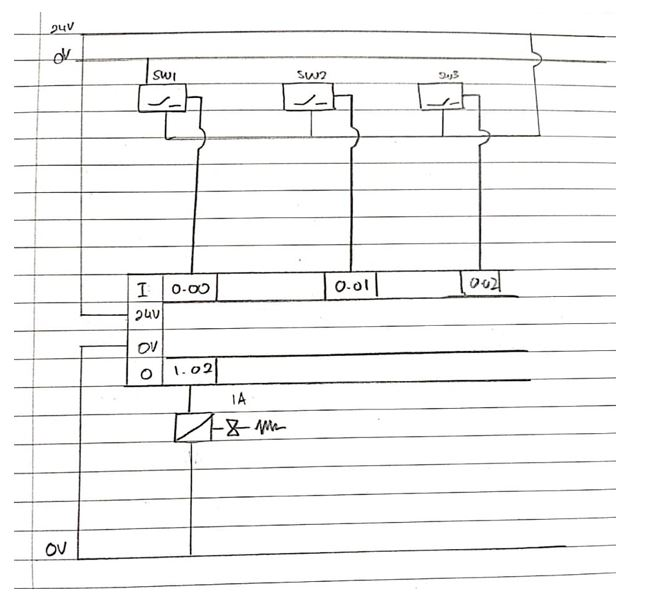

# PLCRoomLighting

This project is designed to reduce power consumption from lighting appliances being left turned on without any human presence. The scenario set for this is that people would enter a room and it would trigger the lights to turn on

A safety feature would also be installed which is a metal detector.

A 4-bit password is also added just as a means to learn more about PLC Ladder Diagrams. The 4-bit password works perfectly by providing users two chances to enter the password before locking the system.

The ladder diagram can be found in the src file.

## Hardware Connection

The sensors and actuators are connected to the OMRON PLC following this diagram.

## Demonstration

### Password Failure

https://www.youtube.com/shorts/fdQshXk_Ds4

### Password Access

https://www.youtube.com/shorts/a9QdcGHmzL8